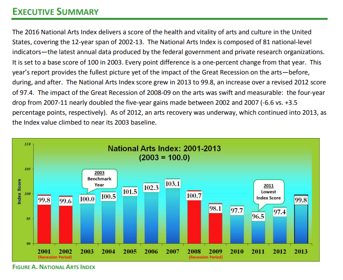
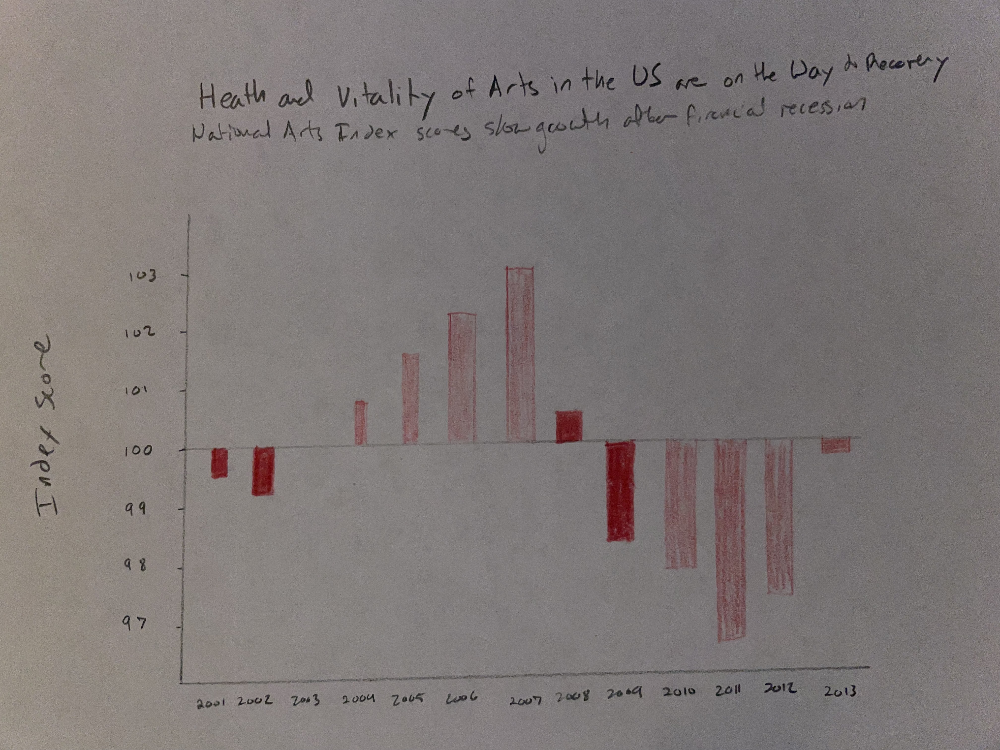

| [visualizing debt](visualizing-government-debt) | [critique by design](critique-by-design) | [final project I](final-project-part-one) | [final project II](final-project-part-two) | [final project III](final-project-part-three) |

# Critique by Design

For this project I chose to redesign this visualization because the content is relevant to my interests and future work. The visualization comes from a report by Americans for the Arts in 2016 on a study of the National Arts Index. (https://www.americansforthearts.org/sites/default/files/NAI%202016%20Final%20Web%20Res.042216.pdf) As an arts manager, it is my job to be able to advocate for the arts within my own organization as well as with funders and lawmakers. This visualization is derived from very useful data, but does not do the best job at expressing its meaning and usefulness to the audience. 

I first criticued the original visualization using Frew's Data Visualization Effectiveness Profile. This lead me to find that the data presented in the chart is clear and meaningful, but that the chart is not aesthetically pleasing and does not do a goo djob of providing context to the data. The primary audience for this tool is managers and executives within the arts. The visualization is not effective for reaching the audience because it does not do enough to provide context and be talked about and shared without the accompanying report. 

I first made changes to diminish distraction and add contect to the visualization. I did this by changing the y axis scale to show the benchmark year and index score of 100 at zero on the graph. This way it is easier to visualize the positive and negative movement of the score over the years. I also changed the title to "Health and Vitality of Arts in the US is on the Way to Recovery" and added a subtitle "National Arts Index scores show growth after financial recession" to give more useful context to the data presented in the visualization. The following sketch is my wireframe of this reimagination. 

I then tested the wireframe idea by interviewing three individuals after showing this image to them without context. The individuals were a graduate student in their 20s, a college professor in with 70s, and a high school teacher in their 60s. Even with this small sample of readers I was able to find patterns in their understanding of my revisualization of this data. There was confusion over why the baseline score was 100, and everyone suggested more context to the idea of recession either by way of legend or explanation of the index. It was clear to all three individuals that the intended audience was arts managment professionals either for their own understanding to to show to funders and lawmakers. I also found that the context my redesigned labels made was incorrect to the new readers and decided to adapt those based on the interviewees' answers and perception. 

