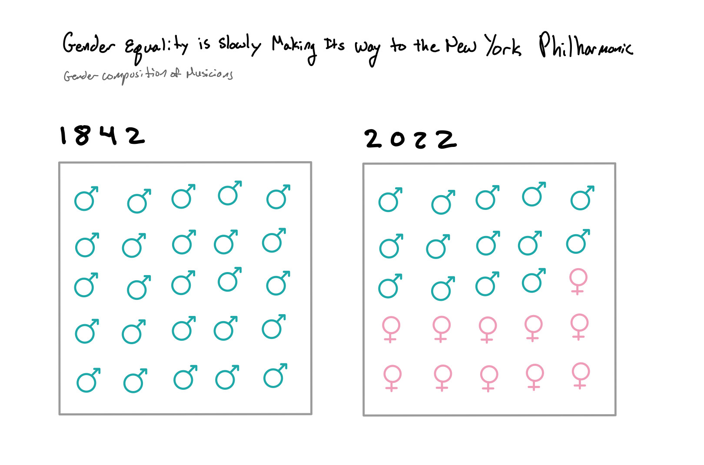
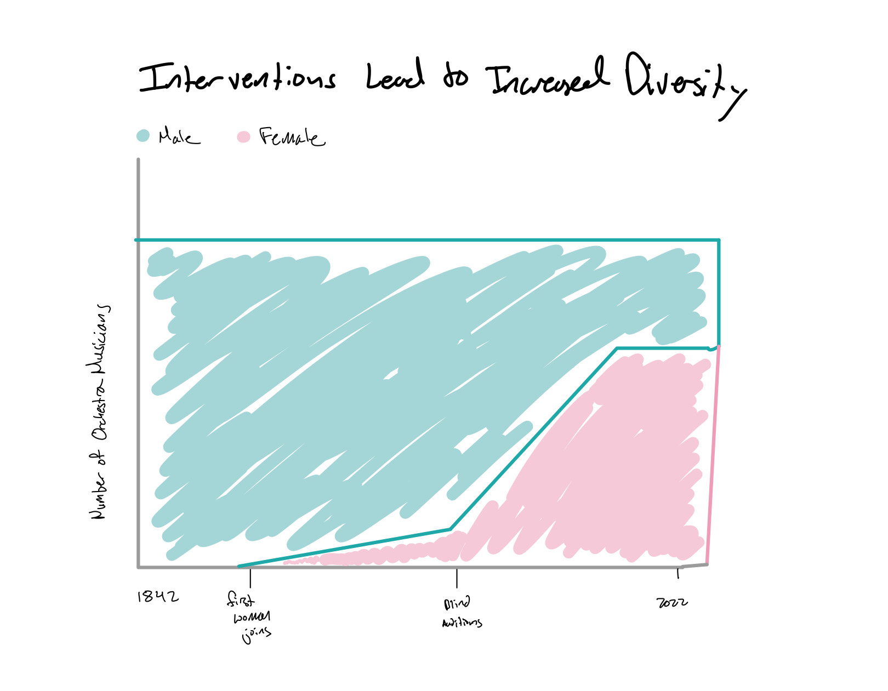

| [home page](https://cmustudent.github.io/tswd-portfolio-templates/) | [visualizing debt](visualizing-government-debt) | [critique by design](critique-by-design) | [final project I](final-project-part-one) | [final project II](final-project-part-two) | [final project III](final-project-part-three) |

# Final Project Part One
## Outline
To complete this project I will be looking at diversity of programming and perssonel in a professional over time. I am looking to see if there are general trends in the ammount of diversity the New York Philharmonic has had over its time as a professional orchestra since 1842. I am also interested in seeing if any changes in programming or musician diversity line up with major world events such as the Black Lives Matter movement or major changes in the orchestral field such as the implimentation of blind auditions. I want to show how interventions can affect the diversity of professional orchestras and show that visibility and access from the professionals and from education programs can help the profession continue on the path to more diverse and inclusive composition.

The setup of this story is that the New York Philharmonic, as a benchmark professional orchestra, began as a male-only ensemble and has been slow to change over time. The conflict is that women and people of color are just as able to produce world-renown music, but have not had the opportunity or support to do so for a majority of orchestral history. The Resolution is that interventions such as blind auditions, more visibility for minorities, and more supportive education programs can change the trends and create a more inclusive and diverse profession. 

## Initial Sketches

## The Data
The raw data I plan to use to complete this project is from the New York Philharmonic archives. They provide public data containing information on decades worth of subscriber, orchestra member, and program data. I will use program data covering a handful of years between 1842 and 2022 to look for trends in programmed works by living composers, female composers, and composers of color. I will also look for trends over time in gender composition of the orchestra musicians and compare this to known dates of interventions such as blind auditions. 

I will also be suplimenting this data set with figures and statistics from public reports by the Sphninx Organization, the American League of Orchestras, and the National Association for Music Education. This supplimentary data will help fill gaps in the context of the New York Phil's archive data and help tell the story of how representation and education can make a difference in the progress and diversity of professional programs.  

https://archives.nyphil.org/index.php/open-data\
https://nafme.org/music-education-needs-incorporate-diversity/
https://americanorchestras.org/making-the-case-for-equity-diversity-and-inclusion-in-orchestras/
https://www.sphinxmusic.org/annual-report

## Method and Medium
I will complete this project using Shorthand. I plan to create visualizations of the raw data and statistics found in the suplimentary resports using a combination of tools such as Canva, Flourish, and Tableau. I will then impliment these graphs and visualizations into Shorthand to tell the story all together. 
