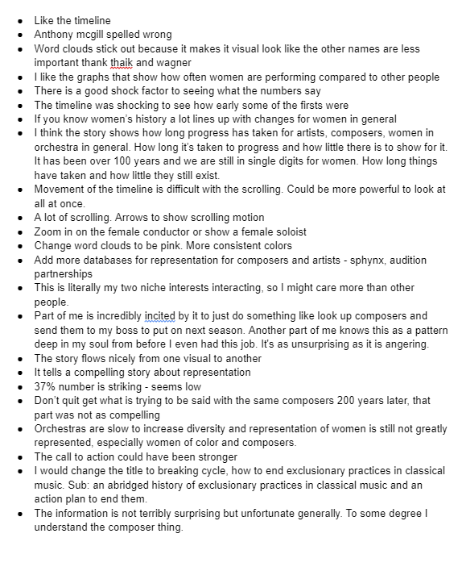

| [home page](https://cmustudent.github.io/tswd-portfolio-templates/) | [visualizing debt](visualizing-government-debt) | [critique by design](critique-by-design) | [final project I](final-project-part-one) | [final project II](final-project-part-two) | [final project III](final-project-part-three) |

# Final Project Part Three
This section is the culmination of all of the work I have previously done creating a compelling story with a data set from the New York Philharmonic. 

The final visual canbe found here https://final-presentation.shorthandstories.com/why-are-my-skills-not-enough-to-make-it-in-the-orchestra/index.html

## Reflection 
Through completing my in-class presentation, I realized I needed to have a bit more focus on who my intended audience was. I narrowed it down to Artistic Administrators and adjusted my message and call to action acordingly. I believe this audience could have the biggest impact on the issue and would be most interested by what the data is showing. 

Following my process for choosing people to interview I ended up collaborating with a female artistic administrator in her late 20s, a  male musician and nonprofit professional in his mid 20s, a male classical music enthusiest in his late 60s, a female arts manager in her mid 30s, and a male stem grad student in his mid 20s. 

Through my interviews I found that the message of the story and call to action were missing a little bit from the context of the visuals. Some interviewees thought it was more of an informational presentation than a call to action. To address this, I changed the subtitle of the presentation to give more context to the actionability right from the begining. This was suggested by an interviewee as a means to help a viewer understand purpose from the get-go. I also added some more interesting story text to help guide the story through the visuals and add more meaning behind the visuals. Additionally, I followed interviwee feedback that suggested a more cohesive color scheme and a slightly different flow. I did this by adjusting the color of the word clouds and changing the layout of the timeline to show everything all at once with less scrolling back and forth. 

I also found through feedback that this information is not surprising which adds to the question of why is so little being done to change this. Some quotes I got from interviewees can be seen here:

**"Part of me is incredibly incited by it to just do something like look up composers and send them to my boss to put on next season. Another part of me knows this as a pattern deep in my soul from before I even had this job. It's as unsurprising as it is angering."**

**"The information is not terribly surprising but unfortunate generally."**

The rest of my notes from the Interviews can be found below. 

